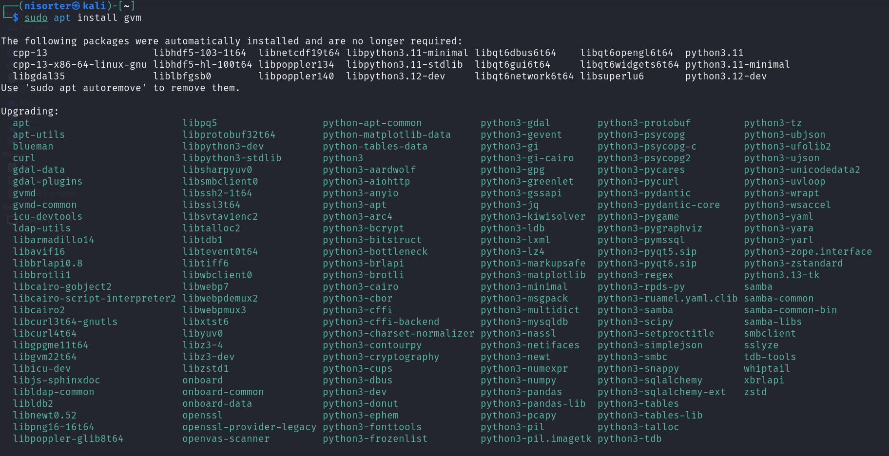
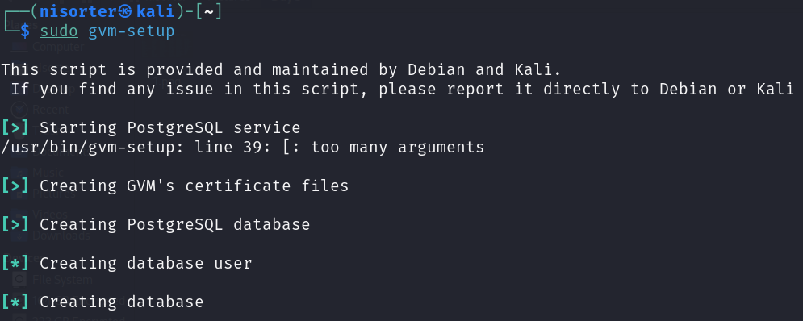
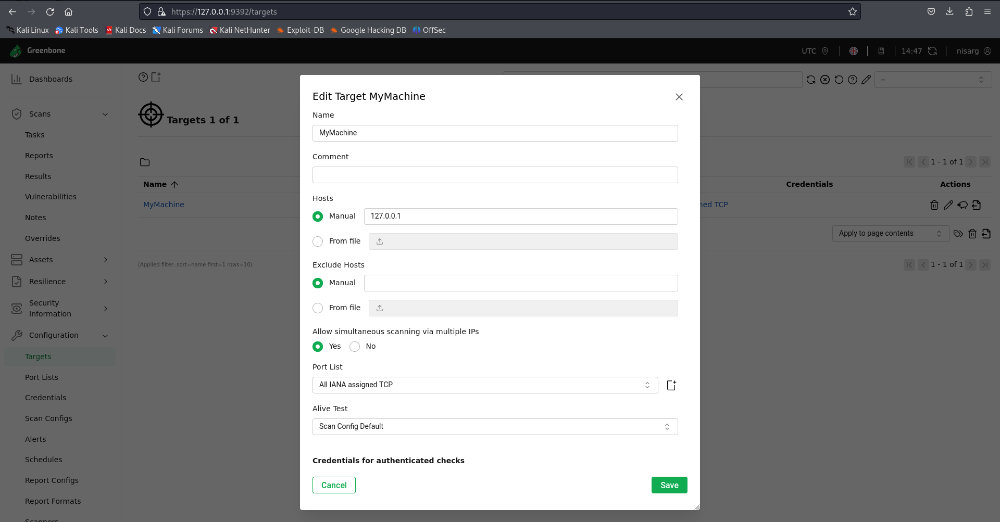
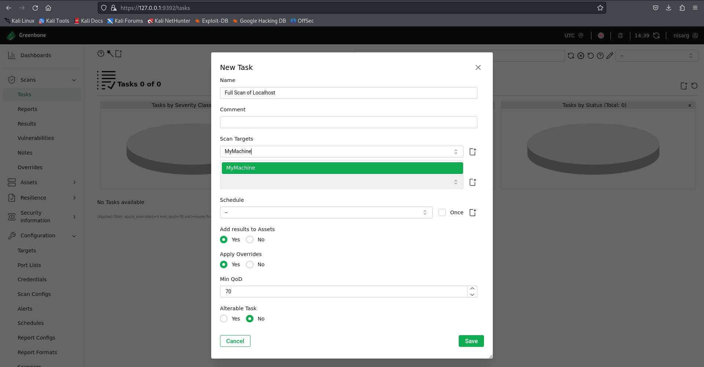
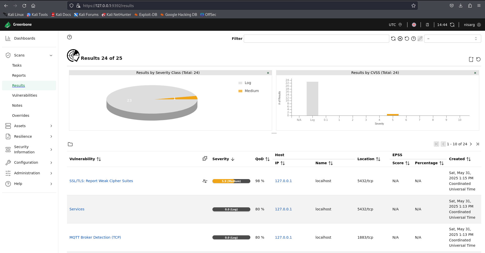

# Elab_Day_3
# 🔐 Cyber Security Internship – Day 3 Task

## 📌 Task Title: Perform a Basic Vulnerability Scan on Your PC

This repository documents the completion of **Day 3** of the Cyber Security Internship.  
The goal of this task was to perform a vulnerability scan on a local machine using **OpenVAS** and analyze the results.

---

## 🧭 Task Guide (Given)

> The following 8 steps were provided as the mini-guide for this task:

1. Install OpenVAS or Nessus Essentials.  
2. Set up the scan target as your local machine IP or `localhost`.  
3. Start a full vulnerability scan.  
4. Wait for the scan to complete (may take 30–60 mins).  
5. Review the report for vulnerabilities and severity.  
6. Research simple fixes or mitigations for found vulnerabilities.  
7. Document the most critical vulnerabilities.  
8. Take screenshots of the scan results.

---

## 🛠️ Tools & Setup

- **Tool Used:** OpenVAS (Greenbone Vulnerability Manager)
- **OS Environment:** Kali Linux
- **Target:** 127.0.0.1 (localhost)
- **Scan Type:** Full and Fast
- **Database:** PostgreSQL (for GVM backend)

---

## 🔍 Full Process Walkthrough

### ✅ Step 1: Install OpenVAS
Command used:
```bash
sudo apt install gvm

```



---
## ✅ Step 2: Set Up Scan Target

After setting up OpenVAS successfully, I proceeded to configure the **scan target** using the Greenbone Security Assistant web interface.

### 🔹 Access:
- URL: `https://127.0.0.1:9392`
- Logged in with the GVM credentials created during setup.

### 🔹 Target Configuration Details:
- **Target Name:** MyMachine
- **IP Address:** 127.0.0.1 (localhost)
- **Port List:** All IANA Assigned TCP
- **Alive Test:** Consider Alive
- **SSH Credential/Port:** Not configured (basic scan only)

This configuration tells OpenVAS to scan all TCP ports on the localhost and treat the machine as online for the scan process.

📸 *Screenshot – Target Configuration:*  


---


## ✅ Step 3: Start a Full Vulnerability Scan

After configuring the target in Greenbone, I created a new task for scanning:

- **Scan Name:** Full Scan of Localhost
- **Scan Target:** MyMachine (127.0.0.1)
- **Scan Config:** Full and Fast
- **QoD Threshold:** 70
- **Overrides Applied:** Yes

📸 *Screenshot – Scan Task Setup:*  


---

## ⏳ Step 4: Wait for the Scan to Complete

The scan was started and monitored through the Greenbone interface.  
It took approximately **30–45 minutes** to complete.  
The progress indicator showed scan completion in real time, with updates on the number of results discovered.

---

## 📊 Step 5: Review Report for Vulnerabilities and Severity

After the scan completed, I navigated to the **Results** section in the sidebar to view all detected issues.

Key Observations:
- **Total Results:** 24
- **Critical Issues:** 0
- **High Issues:** 0
- **Medium Issues:** 1
- **Log Level Issues:** 23
- The most severe finding was:  
  **SSL/TLS: Report Weak Cipher Suites** with a CVSS score of **5.9 (Medium)**

📸 *Screenshot – Detailed Vulnerability Results:*  


---

## ✅ Step 6: Review Report for Vulnerabilities and Severity

After the scan completed, I navigated to the **Results** section in the Greenbone interface to analyze the vulnerabilities detected.

### 🔹 Key Observations:
- **Total Vulnerabilities Found:** 24
- **Severity Levels:**
  - Critical: 0
  - High: 0
  - Medium: 1
  - Low/Log: 23

The results were sorted by severity to quickly identify the most impactful vulnerabilities.

### 🔹 Reporting Interface:
- The Greenbone interface provides a detailed breakdown of each finding.
- Each result includes:
  - CVSS score
  - Vulnerability summary
  - Affected port/service
  - Links to CVE and mitigation recommendations

---

## ✅ Step 7: Document the Most Critical Vulnerability

After reviewing the vulnerability scan results, I documented the most critical issue based on CVSS score and risk description.

### 🚨 Vulnerability Summary

- **Name:** SSL/TLS: Report Weak Cipher Suites  
- **CVSS Score:** 5.9 (Medium)  
- **Affected Host:** 127.0.0.1  
- **Port:** 5432/tcp (commonly used by PostgreSQL)  

### 📖 Description:
The SSL/TLS service on the target system is configured to support **weak cipher suites**. These weak ciphers (like RC4, 3DES, and EXPORT ciphers) can allow attackers to exploit cryptographic weaknesses, making it possible to decrypt or manipulate encrypted communications.

### 🛠️ Mitigation Steps:
To remediate this issue:

- **Disable** support for weak SSL/TLS cipher suites.
- **Enforce strong encryption protocols** such as TLS 1.2 or TLS 1.3.
- **PostgreSQL Config Example:**
  ```conf
  ssl_ciphers = 'HIGH:!aNULL:!MD5:!RC4:!3DES:!EXPORT'

  ```
---

## ✅ Step 8: Take Screenshots of the Scan Results

To complete the documentation process, I captured screenshots of the scan results from the Greenbone Security Assistant web interface.

These screenshots are helpful for visual evidence of:

- The scan status (Completed)
- Number and severity of vulnerabilities
- Identified vulnerabilities and affected ports/services
- Interface of the Greenbone report dashboard

📸 *Screenshot – Final Scan Results Overview:*  


This concludes the full process of performing a basic vulnerability assessment using OpenVAS as part of the Day 3 Cyber Security Internship task.

---


